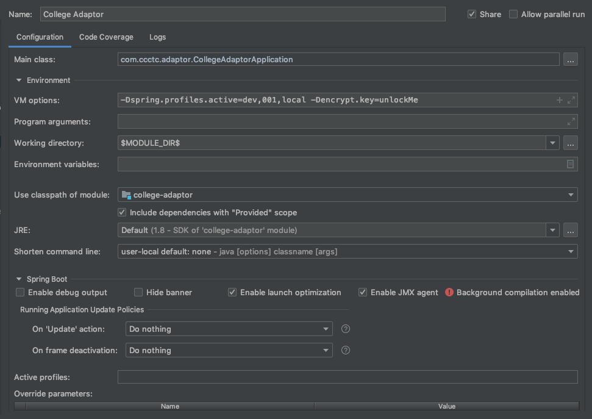

```
Copyright (c) 2019 California Community Colleges Technology Center
Licensed under the MIT license.
A copy of this license may be found at https://opensource.org/licenses/mit-license.php
```

# College Adaptor : Getting Started


## Overview

Below gives a quick start introduction to doing college adaptor development locally.


## GIT

The first place to start is to clone the git repo locally.

From the parent directory, run these commands

```bash
    git clone git@bitbucket.org:cccnext/cccnext-college-adaptor.git
    cd cccnext-college-adaptor
    mvn clean install -DskipTests
```

The project's [pom.xml](pom.xml) file and maven build produces these artifacts:

- compiled JAR: target/college-adaptor-{VERSION}.jar
- docker image in local docker registry: ccctechcenter/college-adaptor:latest


## Running locally

With the above git clone and maven compile commands, you can then run the adaptor locally in various ways.

### IntelliJ IDE

Most developers use IntelliJ as their IDE.  The documentation, examples and support from other devs is likely to center around IntellijJ.  However, any IDE and local dev preferences are acceptable - but not documented below.




### Docker

This runs the adaptor locally using the mis 001 for the mock data.

```bash
docker-compose up college-adaptor-001
```

### Commandline

```bash
java -jar target/college-adaptor-*-SNAPSHOT.jar --spring.profiles.active=dev,001  --encrypt.key=ThisIsNotTheActualKey
```

## Testing locally

Staring the adaptor in any method above (IDE, Docker, JAR) will start on port 8443 and can be tested with the following simple call to get a list of all terms

```bash
curl --insecure -X GET \
  'https://localhost:8443/terms?mis=001' \
  -H 'Content-Type: application/json' \
  -H 'cache-control: no-cache'
```


# Related links:

GIT URL: [https://bitbucket.org/cccnext/cccnext-college-adaptor](https://bitbucket.org/cccnext/cccnext-college-adaptor)

